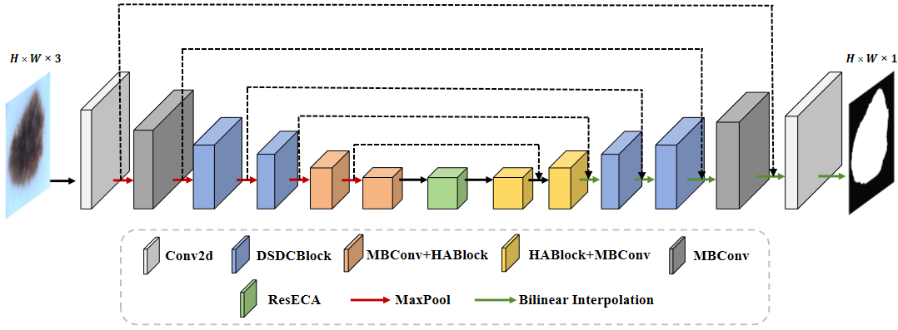
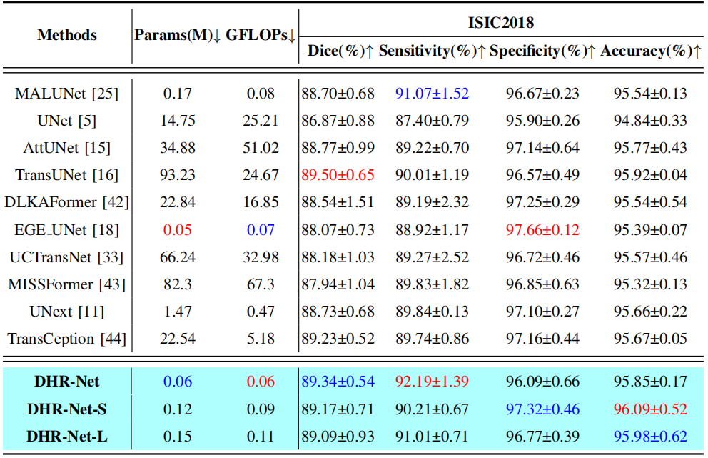
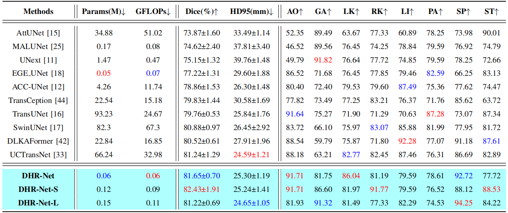
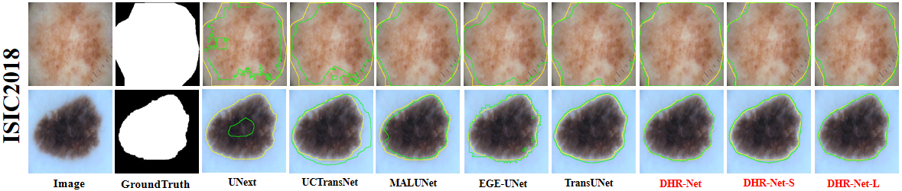
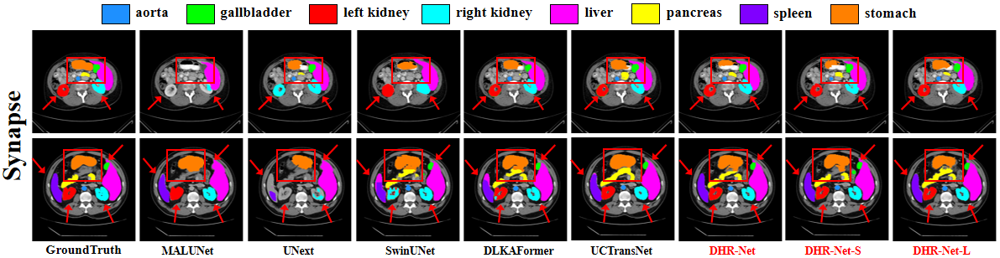

# DHR-Net

This repository is the official implementation of DHR-Net is Definitely What You Need for
Medical Image Segmentation using PyTorch. Please read our preprint at the following link: (https://www.techrxiv.org/doi/full/10.36227/techrxiv.173161317.72325198/v1)




## Main Environments

- python 3.9
- pytorch 2.1.0
- torchvision 0.16.0


## Requirements

Install from the `requirements.txt` using:

```
pip install -r requirements.txt
```


## Prepare the dataset.

- The DDTI datasets, can be found [here](https://drive.google.com/drive/folders/1za9f38XKx-VYPxxb_xx83Dpk-Wg3Yaw8?usp=sharing)
- The Kvasir-Seg  datasets, can be found [here](https://link.zhihu.com/?target=https%3A//datasets.simula.no/downloads/kvasir-seg.zip)
- The ISIC2018 datasets, can be found [here](https://challenge.isic-archive.com/data/)
- The Synapse datasets, can be found [here](https://drive.google.com/file/d/1vxZ_eqqyycFva3luuDKZSTtyfd8-Uv3B/view)


## Train the Model

First, modify the model, dataset and training hyperparameters (including learning rate, batch size img size and optimizer etc) in `Config.py`

Then simply run the training code.

```
python3 train_model.py
```


## Evaluate the Model

#### 2. Test the Model

Please make sure the right model, dataset and hyperparameters setting  is selected in `Config.py`. 

Then change the test_session in `Config.py` .

Then simply run the evaluation code.

```
python3 test_model.py
```

# Results
## Experimental results on the ISIC2018 dataset
Comparative experimental results on the ISIC2018 dataset. Red represents the best result. Best results are shown in red, second best in blue. All results are in ‘mean ± standard deviation’ format.


## Experimental results on the Synapse dataset
Comparative experimental results on the Synapse dataset. Best results are shown in red, second best in blue. Results for Dice and HD95 are expressed as “mean ± standard deviation”. AO(Aorta), GA(gallbladder), LK(left kidney), RK(right kidney), LI(liver), PA(pancreas), SP(spleen), and ST(stomach).


## Qualitative Results on ISIC2018


## Qualitative Results on Synapse



## Reference
- [TransUNet](https://github.com/Beckschen/TransUNet)
- [UCTransNet](https://github.com/McGregorWwww/UCTransNet)
- [SwinUnet](https://github.com/HuCaoFighting/Swin-Unet)
- [ACC_UNet](https://github.com/qubvel/segmentation_models.pytorch)
- [UNeXt](https://github.com/jeya-maria-jose/UNeXt-pytorch)
- [EGE-UNet](https://github.com/JCruan519/EGE-UNet)
- [MALUNet](https://github.com/JCruan519/MALUNet)
- [MISSFormer](https://github.com/ZhifangDeng/MISSFormer)
- [AttUNet](https://github.com/ozan-oktay/Attention-Gated-Networks)
- [DLKAFormer](https://github.com/xmindflow/deformableLKA)
- [TransCeption](https://github.com/xmindflow/TransCeption)


## Citation

If you find this work useful in your research or use this dataset in your work, please consider citing the following papers:
```
@article{Yang_2024,
title={DHR-Net is Definitely What You Need for Medical Image Segmentation},
url={http://dx.doi.org/10.36227/techrxiv.173161317.72325198/v1},
DOI={10.36227/techrxiv.173161317.72325198/v1},
publisher={Institute of Electrical and Electronics Engineers (IEEE)},
author={Yang, Yingwei and Huang, Haiguang and Chen, Huiling and Shao, Yingsheng and Zhang, Zhihan and Chen, Beilei},
year={2024},
month=nov }
```

