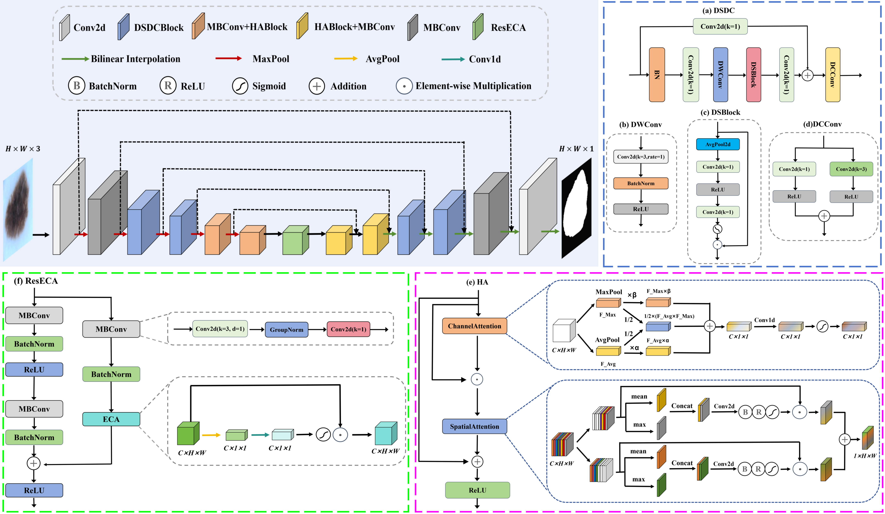

# DHR-Net

This repository is the official implementation of DHR-Net: An ultra-lightweight U-Net based on efficient convolutional attention for medical image segmentation using PyTorch.




## Main Environments

- python 3.9
- pytorch 2.1.0
- torchvision 0.16.0


## Requirements

Install from the `requirements.txt` using:

```
pip install -r requirements.txt
```


## Prepare the dataset.

- The Kvasir-Seg  datasets, can be found here ([link]())
- The CVC-ClinicDB datasets, can be found here ([link](https://polyp.grand-challenge.org/CVCClinicDB/))
- The DDTI datasets, can be found here ([link](https://link.zhihu.com/?target=http%3A//cimalab.intec.co/applications/thyroid/))
- The ISIC2018 datasets, can be found here ([link](https://challenge.isic-archive.com/data/#2018))
- The Synapse datasets, can be found ([link](https://www.synapse.org/#!Synapse:syn3193805/wiki/))


## Reference

- [TransUNet](https://github.com/Beckschen/TransUNet)

- [UCTransNet](https://github.com/McGregorWwww/UCTransNet)

- [ACC_UNet](https://github.com/qubvel/segmentation_models.pytorch)

- [UNeXt](https://github.com/jeya-maria-jose/UNeXt-pytorch)

- [DAEFormer](https://github.com/xmindflow/DAEFormer)

- [D-LKANet](https://github.com/xmindflow/deformableLKA)

- [UDTransNet]( https://github.com/McGregorWwww/UDTransNet)

- [TransCeption](https://github.com/xmindflow/TransCeption)


