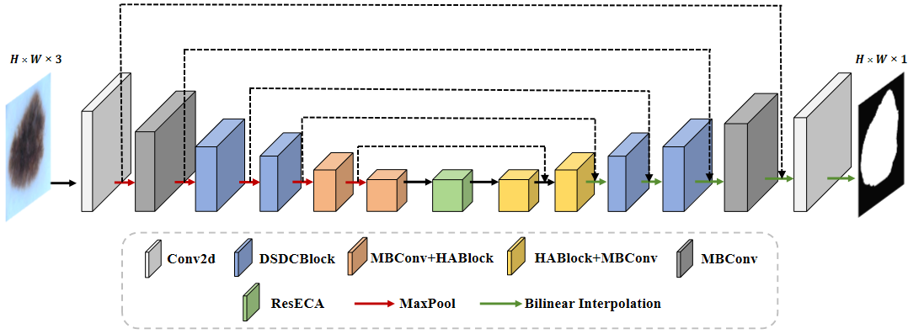

# DHR-Net




## Main Environments

- python 3.9
- pytorch 2.1.0
- torchvision 0.16.0


## Requirements

Install from the `requirements.txt` using:

```
pip install -r requirements.txt
```


## Prepare the dataset.
- The DDTI datasets, can be found here ([link](http://cimalab.intec.co/applications/thyroid/))
- The CVC-ClinicDB datasets, can be found here ([link](https://polyp.grand-challenge.org/CVCClinicDB/))
- The Kvasir-SEG datasets, can be found ([link](https://link.zhihu.com/?target=https%3A//datasets.simula.no/downloads/kvasir-seg.zip))
- The Synapse datasets, can be found ([link](https://www.synapse.org/Synapse:syn3193805/wiki/89480))
- The ISIC2018 datasets, can be found here ([link](https://challenge.isic-archive.com/data/))


## Reference
- [UCTransNet](https://github.com/McGregorWwww/UCTransNet)
- [Swin-Unet](https://github.com/HuCaoFighting/Swin-Unet)
- [ACC_UNet](https://github.com/qubvel/segmentation_models.pytorch)
- [UNeXt](https://github.com/jeya-maria-jose/UNeXt-pytorch)
- [MALUNet](https://github.com/JCruan519/MALUNet)
- [DLKA-Net](https://github.com/xmindflow/deformableLKA)


